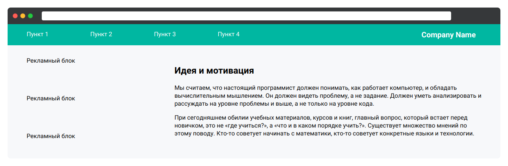

# Флекс-контейнер

Двухколоночный макет — частый выбор при создании сайта. Это очень простая структура документа, а с использованием Flex создавать её можно ещё быстрее.

В данном задании представлен макет страницы. С помощью флекс-контейнеров вам надо сверстать его до конца. Вся вёрстка есть в файле _1-container.html_, а в файле _1-container.css_ уже определена большая часть стилей.

В конечном итоге у вас должна получиться страница следующего вида:

## 1-container.css

Допишите все необходимые стили, чтобы элементы выстроились так, как на скриншоте. Обратите внимание, что порядок элементов внутри шапки страницы не совпадает с порядком на скриншоте. Используйте свойства, которые вы узнали.
