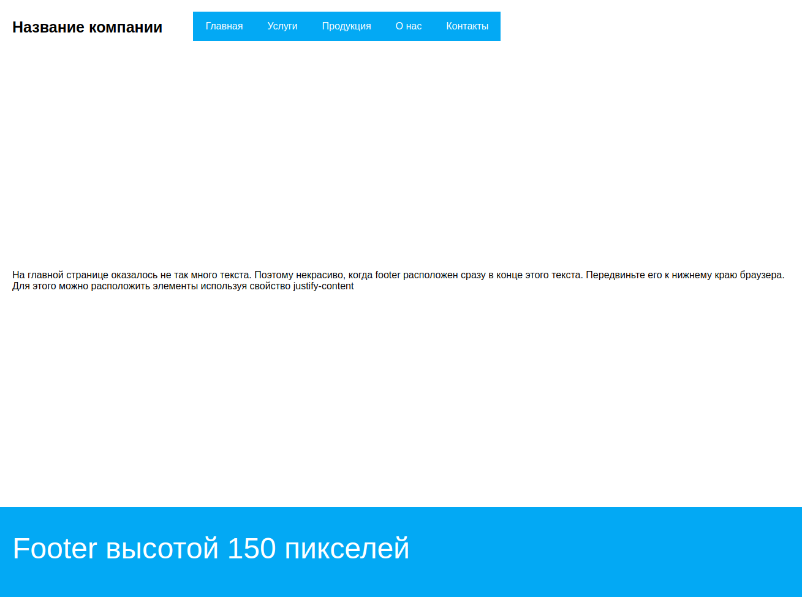

# Выравнивание элементов по главной оси

Наверное, одна из самых частых задач в карьере верстальщика — прижатие футера к низу страницы. Множество способов позволяют сделать эту, с одной стороны, нехитрую манипуляцию, которая требует больших знаний. Флекс позволяет выполнить эту задачу буквально в три строчки кода. Эти три строчки вам и предстоит написать.

В файле _3-justify-content.html_ доступна вся необходимая вёрстка. Ознакомьтесь с классами, которые там используются и обратите внимание на то, как эти классы могут переиспользоваться.

## 3-justify-content.css

Для класса `.container` допишите все необходимые стили. Вспомните про свойство смены направления главной оси. Это понадобится для корректной расстановки элементов.

Конечный результат всех действий будет таков:

