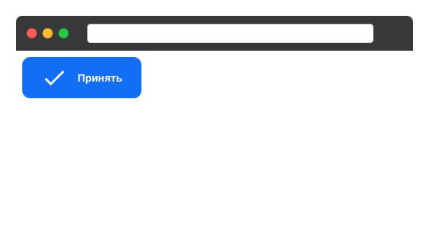

# Выравнивание элементов по поперечной оси

Центрирование элемента по главной и поперечной оси — одна из наиболее распространённых задач в вёрстке. Картинки, блоки, иконки внутри блоков, всё это зачастую необходимо разместить по центру всего родительского блока.

В данном задании вам необходимо создать кнопку, внутри которой будет расположена иконка и текст. Расположение элементов будет по центру относительно всех осей

## 4-align-items.html

Создайте элемент `<button>` со следующими классами:

- `btn` — основные стили кнопки.
- `d-flex` — класс, определяющий Flex-контейнер.
- `flex-center` — класс для установки центрирования элементов внутри контейнера по всем осям.
- `text-white` — класс для добавления белого цвета текста `#fff`.

Внутри элемента `<button>` добавьте:

1. Изображение, которое находится в директории _images_ и установите для него класс `mr-1`. Этот класс будет устанавливать правый внешний отступ.
2. Элемент `` с текстом «Принять».

## 4-align-items.css

В файле уже созданы стили для класса `btn`. Остальные стили допишите самостоятельно.

Для класса `mr-1` правый внешний отступ будет равен `1em`.
