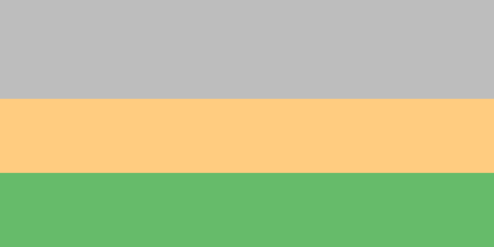

# Свойства Flex-элементов. Гибкость

При создании сеток возникают ситуации, когда необходимо иметь несколько блоков, расположенных вертикально так, чтобы некоторые из них могли менять свой размер, а некоторые нет. Flex позволяет всего в пару свойств создать такую группу блоков.

В файле _6-items-flexible.html_ вы увидите следующую структуру проекта:

```html
<div class="flex-container h-100vh">
  <div class="flex-item bg-gray no-shrink"></div>
  <div class="flex-item bg-orange"></div>
  <div class="flex-item bg-green"></div>
</div>
```

Ваша задача: дописать стили таким образом, чтобы все три блока занимали всю высоту экрана. Они должны уметь сжиматься и увеличиваться в зависимости от текущей высоты экрана. Базовой высотой каждого элемента является значение в 200 пикселей. Первый блок с классом `bg-gray` не должен сжиматься по высоте меньше этого значения. Для этого в файле _6-items-flexible.css_ есть селектор `no-shrink`. Вам необходимо дописать все недостающие правила для данного проекта.

Финальный вид задания:



## Подсказки

- Используйте свойство `flex`.
- Вам пригодится свойство `flex-direction`.
